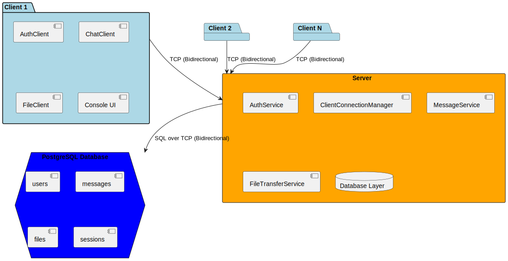

# Console TCP Chat

Консольный чат по TCP: регистрация, вход, текстовые сообщения и передача файлов между пользователями.

## Требования

- .NET 8 (сборка и запуск Server и Client)
- PostgreSQL (для Server)
- Для разработки и ручного применения миграций: `dotnet-ef` (`dotnet tool install --global dotnet-ef`)

## Архитектура

## Состав решения

- **Server** — хост (Worker), TCP-сервер на порту 5001, БД PostgreSQL, файловое хранилище. Миграции применяются при старте ([Program.cs](Server/Program.cs): `context.Database.Migrate()`).
- **Client** — консольное приложение, подключается к Server по адресу и порту.
- **Shared** — общие DTO и протокол (MessageType, payload-классы).

Реализовано: аутентификация (BCrypt), лимиты (соединения, попытки входа, размер файлов), передача файлов (FileStart → FileStartAck/Error → чанки → FileEnd), хранение файлов на сервере с удалением после доставки получателю.

Более подробная информация о структуре решения находится в файле [docs/SOLUTION_STRUCTURE_DETAILED.md](docs/SOLUTION_STRUCTURE_DETAILED.md)

## Конфигурация

**Сервер:** [Server/appsettings.json](Server/appsettings.json) — строка подключения к БД, секции `FileStorage` (BasePath, AllowedExtensions, MaxFileSizeMb), `Server` (IpAddress, Port), `Limits`. В Docker всё переопределяется переменными окружения из [docker-compose.yml](docker-compose.yml); значения берутся из [.env](.env).

**Клиент:** [Client/appsettings.json](Client/appsettings.json) — `ServerAddress`, `ServerPort`, `FileChunkSizeBytes`, `DownloadsPath`. Аргументы командной строки `--host`, `--port` переопределяют конфиг.

**Docker / .env:** скопировать [.env.example](.env.example) в `.env`, задать `DB_NAME`, `DB_USER`, `DB_PASSWORD`, при необходимости `DB_PORT`. В compose эти переменные используются для postgres и для строки подключения сервера.

## Запуск

### Вариант A: Локально (без Docker)

1. Поднять PostgreSQL (например `docker compose up -d postgres` или свой инстанс). В `Server/appsettings.json` или `.env.example` указать хост, порт, БД, пользователь и пароль.
2. Миграции применяются автоматически при старте Server.
3. Сервер: `dotnet run --project Server`
4. Клиент: `dotnet run --project Client`; при необходимости `-- --host <адрес> --port 5001`. Но лучше в Client\appsettings.json параметр ServerAddress поменять на "127.0.0.1"

### Вариант B: Удалённо

1. Запуск файла клиента exe
2. Он сам подключится к серверу, который уже расположен на домене.

## Как протестировать (сервер на домене)

Сервер и БД могут быть развёрнуты на домене. Скачайте клиент (архив с exe) из Releases, запустите exe и подключитесь к серверу (адрес и порт уже прописаны в конфиге клиента). Меню: регистрация (1), вход (2). После входа выберите получателя (нужно ввести его логин) и отправьте сообщение или файл; второй тестер может зайти с другого ПК тем же клиентом.

## Команды клиента и ограничения

- Меню: регистрация (1), вход (2). В чате: выбор получателя (например `/to <логин>`), отправка текста, отправка файла — `/file <путь>` (путь с пробелами в кавычках).
- Ограничения: расширения файлов .jpg, .png, .pdf; макс. размер файла 50 МБ; лимит соединений с одного IP; блокировка после нескольких неудачных попыток входа.

**Проверка:** два клиента — регистрация/логин, выбор получателя, обмен текстом и файлом; отказ при неверном расширении или размере файла; блокировка и лимит соединений при превышении.

